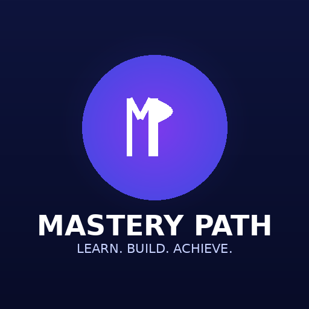

<div align="center">



# MasteryPath

### *Learn. Build. Achieve.*

**The Harada Method, reimagined for the modern professional.**  
Build a personalized 64-action goal chart in 2 minutes — zero setup, zero friction.

---

[](https://masterypath.app)
[](LICENSE)
[](https://masterypath.app)
[](CONTRIBUTING.md)

</div>

---

## What Is This?

Most goal-setting apps give you a to-do list.

**MasteryPath gives you a system.**

Developed by Japanese Olympic coach Takashi Harada and used by world-class athletes, surgeons, and CEOs — the Harada Method forces you to map *every meaningful action* that stands between you and your goal onto a single visual chart.

One page. One goal. 64 specific actions. No excuses.

MasteryPath brings that system into the browser — tailored by profession, guided by design, and ready to share.

---

## The Chart

<div align="center">

```
┌─────────┬─────────┬─────────┬─────────┬─────────┬─────────┬─────────┬─────────┬─────────┐
│  A1–A8  │  B1–B8  │  C1–C8  │         │         │         │  C1–C8  │  B1–B8  │  A1–A8  │
├─────────┼─────────┼─────────┼─────────┼─────────┼─────────┼─────────┼─────────┤         │
│         │  Task A │         │         │  Task B │         │         │  Task C │         │
├─────────┼─────────┼─────────┼─────────┼─────────┼─────────┼─────────┼─────────┼─────────┤
│         │         │         │  Task D │  ★ GOAL │  Task E │         │         │         │
├─────────┼─────────┼─────────┼─────────┼─────────┼─────────┼─────────┼─────────┼─────────┤
│         │  Task F │         │         │  Task G │         │         │  Task H │         │
└─────────┴─────────┴─────────┴─────────┴─────────┴─────────┴─────────┴─────────┴─────────┘
    Your goal at center · 8 key tasks surrounding it · 8 actions per task = 64 total
```

</div>

---

## Features

### For Clients
- **4-step guided onboarding** — profession → goal → timeframe → key tasks
- **14 profession templates** — pre-filled with best practices for your field
- **64 editable action cells** — every sub-task tailored, every one changeable
- **Progress tracker** — visual completion bar across all 64 actions
- **Email capture** — save chart and receive weekly reminders

### For Coaches & Teams *(Pro / Coach)*
- **PDF Export** — beautifully formatted, client-ready
- **Shareable links** — send a live chart URL to anyone
- **Client portal** — manage multiple clients, track their progress
- **White-label branding** — your logo, your colours, your domain
- **Bulk generation** — create charts for an entire cohort in seconds

---

## Profession Templates

| Category | Professions Covered |
|---|---|
| **Technology** | Software Developer, UX/UI Designer |
| **Business** | Entrepreneur, Sales Professional, Marketing Pro, Finance Professional |
| **Leadership** | Manager / Leader |
| **Healthcare & Education** | Healthcare Worker, Educator |
| **Creative & Personal** | Writer / Creator, Fitness Professional |
| **Career Transitions** | Career Changer (Remote/Freelance), Student |
| **Fully Custom** | Define your own goal, tasks, and sub-tasks |

Each template ships with **8 key tasks × 8 sub-tasks = 64 profession-specific actions**, researched and written for real-world applicability.

---

## Monetization Model

MasteryPath is a **freemium SaaS** product with three tiers:

```
STARTER          PRO                    COACH
────────         ─────────────────      ──────────────────────
Free             $9/mo · $79/yr         $49/mo · $399/yr
────────         ─────────────────      ──────────────────────
1 chart          Unlimited charts       Everything in Pro
14 templates     PDF Export             Client portal
Progress         Shareable links        White-label branding
tracker          Progress sync          Bulk generation
                 Email support          Team dashboard
                                        CRM integration (Zapier)
                                        Priority support
```

Stripe payment links are pre-wired in `selectPlan()` — swap in your Stripe checkout URLs and you're live.

---

## Getting Started

### Prerequisites
- Node.js 16+ (for deployment only — the app itself is zero-dependency)
- A Vercel, Netlify, or Surge account

### Deploy in 60 Seconds

**Vercel (recommended)**
```bash
npx vercel --prod
```

**Netlify**  
Drag the project folder to [netlify.com/drop](https://netlify.com/drop)

**Surge**
```bash
npm i -g surge && surge . masterypath-app.surge.sh
```

---

## Connecting Stripe

Open `index.html` and find the `selectPlan()` function:

```javascript
function selectPlan(plan) {
  // Replace with your Stripe Payment Link URLs
  const links = {
    pro:   'https://buy.stripe.com/YOUR_PRO_LINK',
    coach: 'https://buy.stripe.com/YOUR_COACH_LINK'
  };
  window.location.href = links[plan];
}
```

Paste in your Stripe Payment Link URLs and billing is live.

---

## SEO

The app ships with a full SEO layer out of the box:

- ✅ Semantic `<title>` and `<meta description>` targeting Harada Method searches
- ✅ Open Graph tags for rich link previews on LinkedIn, Facebook, WhatsApp
- ✅ Twitter Card with `summary_large_image`
- ✅ JSON-LD structured data — `WebApplication`, `Organization`, `WebSite`
- ✅ Canonical URL
- ✅ Web App Manifest for PWA / mobile install
- ✅ `robots` meta with `max-snippet` and `max-image-preview` directives
- ✅ `theme-color` for browser chrome

To complete SEO setup, add:
1. A 1200×630 `og-image.png` to the root
2. Favicons at `/favicon-32x32.png`, `/favicon-16x16.png`, `/apple-touch-icon.png`
3. Update all `https://masterypath.app` URLs to your actual domain

---

## Tech Stack

| Layer | Choice | Why |
|---|---|---|
| **Frontend** | Vanilla HTML/CSS/JS | Zero dependencies, instant load, trivially hostable |
| **Styling** | Custom CSS with CSS variables | Fully themeable, no framework overhead |
| **Data** | In-memory JS objects | No backend needed for core flow |
| **Payments** | Stripe Payment Links | No server required |
| **Hosting** | Vercel / Netlify / Surge | One-command deploy |

**Bundle size:** ~87 KB · **Dependencies:** 0 · **Load time:** <0.5s

---

## Project Structure

```
masterypath-site/
├── index.html          ← Entire app — one file, zero build step
├── site.webmanifest    ← PWA manifest
├── netlify.toml        ← Netlify deploy config
├── vercel.json         ← Vercel deploy config
├── og-image.png        ← Social preview image (add yours)
├── favicon-*.png       ← Favicons (add yours)
└── README.md           ← You are here
```

---

## Roadmap

- [ ] Stripe webhook → unlock Pro features on payment
- [ ] Supabase backend → persist charts across devices
- [ ] Coach dashboard → multi-client management UI
- [ ] PDF generation → server-side with Puppeteer
- [ ] Chart sharing → unique public URLs per chart
- [ ] Mobile app → React Native wrapper
- [ ] Analytics → PostHog event tracking

---

## Contributing

Pull requests are welcome. For major changes, open an issue first to discuss what you'd like to change.

```bash
# 1. Fork the repo
# 2. Create your feature branch
git checkout -b feature/your-idea
# 3. Make changes to index.html
# 4. Open a PR
```

---

## License

MIT © MasteryPath. Free to use, fork, and build upon.

---

<div align="center">

**Built with intention. Designed for mastery.**

[masterypath.app](https://masterypath.app) · [Twitter](https://twitter.com/masterypath) · [LinkedIn](https://linkedin.com/company/masterypath)

*"The goal is not the destination. The path is the practice."*

</div>
